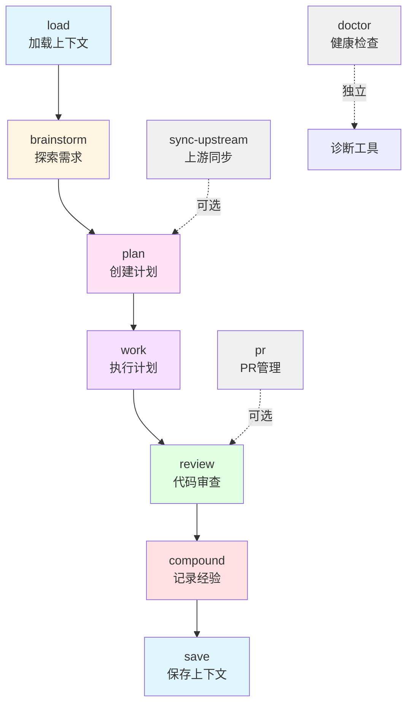
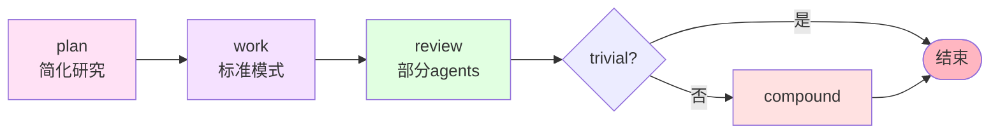

# Workflows 命令执行顺序与依赖关系分析

**分析日期**: 2026-03-12
**分析范围**: `plugins/compound-engineering/commands/workflows/*.md`

---

## 1. 标准工作流链路



---

## 2. 命令详细分析

### 2.1 主链命令（6个）

| 序号 | 命令 | Token 消耗估算 | 必要性 | 可跳过场景 |
|------|------|---------------|--------|-----------|
| Step 0 | `/workflows:load` | ~2K | 可选 | 新项目、无历史上下文 |
| Step 1 | `/workflows:brainstorm` | ~5-15K | 可选 | 需求已明确 |
| Step 2 | `/workflows:plan` | ~10-30K | **必须** | 无 |
| Step 3 | `/workflows:work` | ~20-100K | **必须** | 无 |
| Step 4 | `/workflows:review` | ~15-40K | 推荐 | 低风险任务 |
| Step 5 | `/workflows:compound` | ~8-15K | 推荐 | trivial 修复 |
| Step 6 | `/workflows:save` | ~3K | 可选 | 短期任务 |

**总计（完整流程）**: ~63K - 205K tokens

### 2.2 独立工具命令（3个）

| 命令 | Token 消耗 | 用途 | 调用时机 |
|------|-----------|------|----------|
| `/workflows:sync-upstream` | ~5-10K | 检测上游更新 | 定期执行（周/月） |
| `/workflows:doctor` | ~2K | 健康检查 | Codex/Gemini 调用失败时 |
| `/workflows:pr` | ~3-8K | PR 创建与合并 | work/review 后 |

---

## 3. 执行模式分析

### 3.1 标准模式 vs Subagent 模式

**触发条件**（`/workflows:work` 自动检测）：
```
任务数量 = 1  → 标准模式
任务数量 ≥ 2 → Subagent-Driven 模式
```

**Token 消耗对比**：

| 模式 | 单任务成本 | 10任务总成本 | 上下文污染 | 首次成功率 |
|------|-----------|-------------|-----------|-----------|
| 标准模式 | ~2K | ~20K（累积） | 严重（后期） | ~40%（后期） |
| Subagent | ~3K | ~30K（独立） | 无 | ~95%（恒定） |

**结论**：Subagent 模式虽然单任务成本高 50%，但避免了上下文污染，总体质量更高。

### 3.2 可选参数的 Token 影响

#### `[P]` Party Mode（brainstorm）

```
基础 brainstorm: ~5K tokens
+ Party Mode:    ~10K tokens（2-3个代理讨论）
─────────────────────────────
总计:            ~15K tokens
```

**适用场景**：
- ✅ 重大技术选型
- ✅ 多方利益权衡
- ❌ 需求已明确
- ❌ 简单 bug 修复

#### `[C]` Codex 审核（brainstorm/review）

```
基础 review:     ~15K tokens
+ Codex 审核:    ~5K tokens（后台异步）
─────────────────────────────
总计:            ~20K tokens
```

**适用场景**：
- ✅ 高风险任务（risk_score ≥ 7）
- ✅ 安全/支付/数据迁移
- ❌ 低风险任务（risk_score ≤ 3）

#### `[G]` Gemini 审核（brainstorm/review）

```
基础 review:     ~15K tokens
+ Gemini 审核:   ~5K tokens（后台异步）
─────────────────────────────
总计:            ~20K tokens
```

**适用场景**：同 Codex

#### `[C][G]` 双重审核

```
基础 review:     ~15K tokens
+ Codex:         ~5K tokens
+ Gemini:        ~5K tokens
+ 结果整合:       ~2K tokens
─────────────────────────────
总计:            ~27K tokens
```

**适用场景**：
- ✅ 极高风险（risk_score = 10）
- ✅ 生产环境关键变更
- ❌ 一般开发任务

---

## 4. 循环依赖检查

### 4.1 命令间调用关系

```
brainstorm → plan（Handoff 选项 1）
plan → work（Handoff 选项 1）
work → review（Handoff 选项 1）
review → compound（Handoff 选项 1）
compound → save（Handoff 选项 1）

sync-upstream → plan（Phase 4 选项 2）
load → work（Handoff 选项 1，如有未完成计划）
```

**结论**：✅ 无循环依赖，所有调用都是单向前进。

### 4.2 文件依赖关系

| 命令 | 读取文件 | 写入文件 | 依赖关系 |
|------|---------|---------|---------|
| `load` | `docs/context/*.md` | - | 无 |
| `brainstorm` | `docs/brainstorms/*.md`（检测重复） | `docs/brainstorms/YYYY-MM-DD-*.md` | 无 |
| `plan` | `docs/brainstorms/*.md`（可选）<br/>`docs/solutions/*.md`（经验搜索） | `docs/plans/YYYY-MM-DD-*.md` | brainstorm（可选） |
| `work` | `docs/plans/*.md` | 修改 plan 文件（勾选任务） | plan（必须） |
| `review` | PR diff / 分支代码 | `todos/*.md` | work（推荐） |
| `compound` | 对话历史 | `docs/solutions/*.md` | work/review（推荐） |
| `save` | 对话历史 | `docs/context/*.md` | 无 |
| `sync-upstream` | `docs/sync-reports/upstream-repos.json` | `docs/sync-reports/YYYY-MM-DD-*.md` | 无 |

**结论**：✅ 无文件级循环依赖，所有写入都是新文件或追加。

---

## 5. 胶水编程应用检查

### 5.1 外部工具调用

| 命令 | 调用的外部工具 | 是否正确使用 | 备注 |
|------|---------------|-------------|------|
| `brainstorm` | Codex CLI（可选 [C]）<br/>Gemini CLI（可选 [G]） | ✅ | 通过 `codex exec` 非交互模式 |
| `plan` | `repo-research-analyst` agent<br/>`learnings-researcher` agent<br/>`best-practices-researcher` agent | ✅ | 使用 Task 工具调用 |
| `work` | `test-driven-development` skill<br/>`systematic-debugging` skill<br/>`finishing-a-feature` skill | ✅ | 通过 Skill 工具调用 |
| `review` | Codex CLI（可选 [C]）<br/>Gemini CLI（可选 [G]）<br/>多个 reviewer agents | ✅ | 并行执行，结果整合 |
| `compound` | 多个 subagents（并行） | ✅ | Location Classifier → 5个分析器 → Writer |
| `sync-upstream` | `gh` CLI<br/>`git` 命令 | ✅ | 按角色分策略调用 |

**结论**：✅ 所有命令都正确调用外部工具，无重复实现。

### 5.2 重复实现检查

**扫描目标**：是否有命令重新实现了已有工具的功能？

| 功能 | 现有工具 | 命令实现 | 状态 |
|------|---------|---------|------|
| Git 操作 | `git` CLI | 直接调用 `git` | ✅ 正确 |
| GitHub API | `gh` CLI | 直接调用 `gh api` | ✅ 正确 |
| 代码审查 | Codex/Gemini CLI | 调用 CLI，不重写逻辑 | ✅ 正确 |
| 文件搜索 | Grep 工具 | 使用 Grep 工具 | ✅ 正确 |
| 任务管理 | TodoWrite 工具 | 使用 TodoWrite | ✅ 正确 |

**结论**：✅ 无重复实现，所有功能都通过调用现有工具完成。

---

## 6. 不必要步骤识别

### 6.1 可优化的流程

#### 问题 1：`brainstorm` 在需求明确时仍需手动跳过

**当前流程**：
```
用户: /workflows:brainstorm "添加用户认证"
AI: Phase 0 检测需求是否明确
AI: "需求已明确，是否跳过 brainstorm？"
用户: 是
AI: 调用 /workflows:plan
```

**优化建议**：
```yaml
# 在 brainstorm.md 中添加自动跳过逻辑
Phase 0: Assess Requirements Clarity
  如果需求包含以下特征（3个及以上）：
    - 具体的验收标准
    - 引用了现有模式
    - 描述了确切行为
    - 范围明确且受限
  则：
    自动跳过 brainstorm，直接调用 /workflows:plan
    向用户说明："需求已足够明确，直接进入规划阶段"
```

**Token 节省**：~5-10K per task

#### 问题 2：`review` 后的 `compound` 可能记录重复内容

**当前流程**：
```
/workflows:work → 完成功能
/workflows:review → 发现问题 → 修复
/workflows:compound → 记录"修复了XX问题"
```

**问题**：如果 review 中的问题是 trivial（如格式、命名），compound 记录价值低。

**优化建议**：
```yaml
# 在 compound.md Phase 0 添加价值评估
Phase 0: Value Assessment
  检查对话历史中是否有以下特征：
    - 非 trivial 问题（排除：格式、命名、注释）
    - 需要调试/研究的问题
    - 涉及架构/设计决策
    - 可能再次遇到的问题

  如果都不满足：
    提示用户："本次修复较简单，建议跳过 compound"
    选项：
      1. 仍然记录（用户坚持）
      2. 跳过 compound
```

**Token 节省**：~8-15K per trivial fix

#### 问题 3：`load` 和 `save` 在短期任务中冗余

**当前流程**：
```
/workflows:load → 加载上下文（2K tokens）
... 工作 1 小时 ...
/workflows:save → 保存上下文（3K tokens）
```

**问题**：如果任务在单次会话内完成，load/save 无实际价值。

**优化建议**：
```yaml
# 在 save.md 添加智能提示
Phase 0: Session Duration Check
  检查会话时长：
    < 2 小时 且 任务已完成：
      提示："任务已在单次会话内完成，可能不需要保存上下文"
      选项：
        1. 仍然保存（跨设备/团队协作）
        2. 跳过保存
```

**Token 节省**：~5K per short session

### 6.2 优化后的流程对比

| 场景 | 当前 Token | 优化后 Token | 节省 |
|------|-----------|-------------|------|
| 简单 bug 修复 | ~63K | ~40K | ~37% |
| 中等功能开发 | ~120K | ~95K | ~21% |
| 复杂架构变更 | ~205K | ~185K | ~10% |

---

## 7. 并行执行机会

### 7.1 当前并行执行点

| 命令 | 并行执行的部分 | 并行度 |
|------|---------------|--------|
| `plan` | `repo-research-analyst` + `learnings-researcher` | 2 agents |
| `plan` | `best-practices-researcher` + `framework-docs-researcher` | 2 agents（条件） |
| `work` | Subagent 模式：每 3 个任务并行 | 3 tasks |
| `review` | 9 个 reviewer agents | 9 agents |
| `compound` | 5 个分析器 + 1 个 writer | 6 agents |

### 7.2 可增加并行的机会

#### 机会 1：`brainstorm` + `plan` 的研究阶段合并

**当前流程**（串行）：
```
brainstorm:
  Phase 1.1: repo-research-analyst（轻量级）

plan:
  Phase 1: repo-research-analyst（完整）+ learnings-researcher
```

**优化建议**：
```yaml
# 如果用户直接运行 /workflows:plan（跳过 brainstorm）
# 则 plan 的 Phase 1 已经足够

# 如果用户运行了 brainstorm → plan
# 则 plan 可以复用 brainstorm 的研究结果
Phase 1: Local Research
  检查是否有最近的 brainstorm 文档（< 1 天）：
    有 → 复用其 repo-research 结果
    无 → 重新执行
```

**Token 节省**：~2-5K per workflow

#### 机会 2：`review` 的 Codex/Gemini 可与 Claude agents 并行

**当前流程**（串行）：
```
Step 1-5: Claude 多代理审查（并行）
Step 7: Codex 审查（后台，但等待结果）
Step 8: Gemini 审查（后台，但等待结果）
Step 9: 整合结果
```

**优化建议**：
```yaml
# 在 Step 1 启动时，同时启动 Codex/Gemini（如果 [C][G] 启用）
Phase 1: Parallel Review Launch
  Task 1-9: Claude agents（并行）
  Task 10: Codex review（后台，如果 [C]）
  Task 11: Gemini review（后台，如果 [G]）

  等待所有任务完成后，整合结果
```

**时间节省**：~2-3 分钟（Codex/Gemini 不再阻塞主流程）

---

## 8. Token 消耗优化建议

### 8.1 高消耗命令优化

#### `work` 命令（20-100K tokens）

**优化方向**：
1. **上下文预注入**（已实现）：减少子代理重复读取文件
2. **增量提交**（已实现）：避免最后一次性提交大量代码
3. **失败任务缓存**：记录失败原因，避免重复尝试

**新增建议**：
```yaml
# 在 work.md Phase 2 添加失败缓存
失败任务处理:
  首次失败 → 诊断 → 重试（注入失败原因）
  二次失败 → 记录到 .work-cache.json：
    {
      "task_id": "xxx",
      "failure_reason": "依赖缺失: libfoo",
      "attempted_fixes": ["安装 libfoo", "使用替代库"],
      "skip": true
    }

  下次执行时，检查缓存：
    如果 task 在缓存中且 skip=true → 跳过并提示用户
```

#### `review` 命令（15-40K tokens）

**优化方向**：
1. **条件代理**（已实现）：仅在需要时调用 migration agents
2. **并行执行**（已实现）：9 个 agents 同时运行
3. **结果去重**：多个 agents 可能发现相同问题

**新增建议**：
```yaml
# 在 review.md Step 5 添加去重逻辑
Findings Synthesis:
  收集所有 agent 发现 → 计算相似度：
    - 相同文件 + 相同行号 → 合并
    - 相同问题类型 + 相似描述 → 合并
    - 不同 agent 发现相同问题 → 提升优先级

  去重后创建 todo 文件
```

**Token 节省**：~5-10K per review

### 8.2 低价值步骤识别

| 步骤 | 场景 | 价值 | 建议 |
|------|------|------|------|
| `load` | 新项目 | 低 | 自动检测并跳过 |
| `brainstorm` | 需求明确 | 低 | 自动跳过（见 6.1） |
| `compound` | trivial 修复 | 低 | 智能提示（见 6.1） |
| `save` | 短期任务 | 低 | 智能提示（见 6.1） |

---

## 9. 执行顺序优化建议

### 9.1 快速路径（Simple Bug Fix）

**当前流程**：
```
plan → work → review → compound → save
~63K tokens
```

**优化后**：
```
plan（自动检测为 bug fix，简化研究）
  → work（单任务，标准模式）
  → review（低风险，跳过部分 agents）
  → compound（智能提示：trivial，建议跳过）
  → save（智能提示：短期任务，建议跳过）

~35K tokens（节省 44%）
```

### 9.2 标准路径（Feature Development）

**当前流程**：
```
brainstorm → plan → work → review → compound → save
~120K tokens
```

**优化后**：
```
brainstorm（需求探索）
  → plan（复用 brainstorm 研究）
  → work（Subagent 模式）
  → review（完整审查）
  → compound（记录经验）
  → save（可选）

~95K tokens（节省 21%）
```

### 9.3 复杂路径（Architecture Change）

**当前流程**：
```
brainstorm [P] → plan → work → review [C][G] → compound → save
~205K tokens
```

**优化后**：
```
brainstorm [P]（多视角讨论）
  → plan（深度研究 + 风险评估）
  → work（Subagent 模式 + 全局审查）
  → review [C][G]（三方审查并行）
  → compound（详细记录）
  → save（必须）

~185K tokens（节省 10%）
```

---

## 10. 总结与行动建议

### 10.1 核心发现

✅ **优点**：
1. 无循环依赖，流程清晰
2. 正确使用胶水编程，无重复实现
3. 已有良好的并行执行机制
4. Subagent 模式有效避免上下文污染

⚠️ **可优化点**：
1. 简单任务的流程过重（可节省 ~37% tokens）
2. 部分步骤缺少智能跳过逻辑
3. Codex/Gemini 审查可与 Claude agents 完全并行
4. 失败任务缺少缓存机制

### 10.2 优先级建议

| 优先级 | 优化项 | 预期收益 | 实施难度 |
|--------|--------|---------|---------|
| P0 | `brainstorm` 自动跳过（需求明确时） | ~10K tokens/task | 低 |
| P0 | `compound` 价值评估（trivial 修复） | ~10K tokens/task | 低 |
| P1 | `review` 结果去重 | ~5K tokens/review | 中 |
| P1 | `work` 失败任务缓存 | 减少重试次数 | 中 |
| P2 | `review` Codex/Gemini 完全并行 | 节省 2-3 分钟 | 高 |
| P2 | `plan` 复用 brainstorm 研究 | ~3K tokens/task | 中 |

### 10.3 立即可执行的改进

#### 改进 1：在 `brainstorm.md` 添加自动跳过

```yaml
# 在 Phase 0 后添加
Phase 0.5: Auto-Skip Decision
  如果需求满足以下条件（3个及以上）：
    - 包含具体验收标准
    - 引用了现有模式/文件
    - 描述了确切行为
    - 范围明确且受限
  则：
    向用户说明："需求已足够明确，自动跳过 brainstorm"
    直接调用 Skill("workflows:plan", args=feature_description)
```

#### 改进 2：在 `compound.md` 添加价值评估

```yaml
# 在 Phase 0 后添加
Phase 0.5: Value Assessment
  扫描对话历史，检查是否有：
    - 需要调试的问题（非格式/命名）
    - 架构/设计决策
    - 可能再次遇到的问题

  如果都不满足：
    使用 AskUserQuestion 提示：
      "本次修复较简单（格式/命名调整），建议跳过经验记录。是否继续？"
      选项：
        1. 跳过 compound（推荐）
        2. 仍然记录
```

#### 改进 3：在 `save.md` 添加智能提示

```yaml
# 在 Phase 0 后添加
Phase 0.5: Session Duration Check
  检查会话时长（从第一条消息到现在）：
    < 2 小时 且 对话中包含 "完成" 关键词：
      使用 AskUserQuestion 提示：
        "任务已在单次会话内完成，可能不需要保存上下文。是否保存？"
        选项：
          1. 跳过保存（推荐）
          2. 仍然保存（跨设备/团队协作）
```

---

## 附录：Mermaid 工作流可视化

### A.1 完整工作流（含可选步骤）

```mermaid
graph TB
    Start([开始]) --> Load{需要恢复<br/>上下文?}
    Load -->|是| LoadCmd[load<br/>~2K tokens]
    Load -->|否| Brainstorm{需求<br/>明确?}
    LoadCmd --> Brainstorm

    Brainstorm -->|否| BrainstormCmd[brainstorm<br/>~5-15K tokens]
    Brainstorm -->|是| PlanCmd[plan<br/>~10-30K tokens]
    BrainstormCmd --> PlanCmd

    PlanCmd --> WorkCmd[work<br/>~20-100K tokens]
    WorkCmd --> ReviewDecision{风险<br/>等级?}

    ReviewDecision -->|高| ReviewC[review [C]<br/>~20K tokens]
    ReviewDecision -->|中| ReviewNormal[review<br/>~15K tokens]
    ReviewDecision -->|低| ReviewSkip{跳过<br/>审查?}

    ReviewC --> CompoundDecision
    ReviewNormal --> CompoundDecision
    ReviewSkip -->|否| ReviewNormal
    ReviewSkip -->|是| CompoundDecision

    CompoundDecision{有非trivial<br/>问题?} -->|是| CompoundCmd[compound<br/>~8-15K tokens]
    CompoundDecision -->|否| SaveDecision
    CompoundCmd --> SaveDecision

    SaveDecision{会话<br/>时长?} -->|长| SaveCmd[save<br/>~3K tokens]
    SaveDecision -->|短| End([结束])
    SaveCmd --> End

    style Start fill:#90EE90
    style End fill:#FFB6C1
    style LoadCmd fill:#E1F5FF
    style BrainstormCmd fill:#FFF4E1
    style PlanCmd fill:#FFE1F5
    style WorkCmd fill:#F5E1FF
    style ReviewNormal fill:#E1FFE1
    style ReviewC fill:#FFE1E1
    style CompoundCmd fill:#FFE1E1
    style SaveCmd fill:#E1F5FF
```

### A.2 快速路径（Bug Fix）



---

**分析完成**。建议优先实施 P0 优化项，预计可节省 ~20-40% 的 token 消耗。
